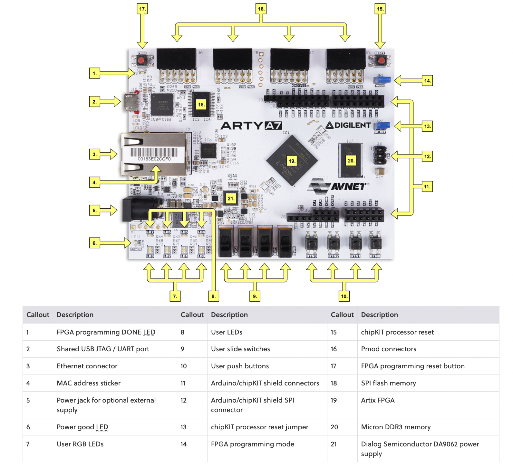

# Traffic Light Control System using FPGA
I developed a traffic light control system for a T-intersection of a highway and a country road using a finite state machine (FSM) using Verilog. It has additional feature to take in account country road vehicles and accordingly give green light. Then I implemented the design on the Xilinx Arty A7-100T FPGA Board.

## Specifications
The traffic light control system consists of:
2 inputs: reset, CR_Vehicle_detect
12 outputs: 12 individual lights (4 lights per side)
6 states

## State Diagram

The states are chosen so that each lane has atleast one green light to move to any of the other two roads atleast once in a given cycle.
I tried to give practical green and yellow light times for all lanes.
* The initial state SO is ON for the most time (64 seconds). This is because most traffic flows in this orientation
* The state S2 enables the country roadvdrivers to enter on the highway on either lane. This is ON for only 16 seconds as there are not many cars on the country road and we also can't
make the highway drivers wait for too long.
* The state S4 enables the Highway lane 1 drivers to make a right turn. This is ON for 20 seconds.
* The intermediate state S6 is ON if there is no vehicle on the country road. It allows the system to bypass the state S2 which is not required.
* All yellow lights are ON for 4 seconds.

## Verilog Code
3 verilog files are added to the repository:
design file, simulation file, constraint file
Simulation waveform: https://drive.google.com/file/d/1i65geBSB8cCKDr96NO9i9tPhoWW0H1CO/view?usp=sharing

# FPGA Implementation 
To implement the module on an FPGA board, I first modified the Arty A7-100T constraint file to configure all required ports.

## Port configuration

On the FPGA, the following ports were used:
* 2 switches: for inputs reset and CR_Vehicle_Detect
* 1 LED: for clock of period 1 second, ie, LED blinks after 1 second interval
* 3 PMOD connectors: for connecting the 12 external LEDs to display output

## Synthesis
The synthesis tool analyzes the RTL code and translates it into a network of logic gates and registers. The result is a netlist that describes how the design should be implemented in hardware.

## Implementation
Implementation is the process that takes the synthesized netlist and maps it onto the actual FPGA hardware. It involves two key steps: placement and routing.

## Generate bitsream
Bitstream Generation is a step in the VLSI digital design flow that produces the final configuration file used to program the FPGA. This bitstream file contains the complete configuration data that defines how the FPGA’s resources should be configured.

## Working video
https://drive.google.com/file/d/1Cf4JP_ue7Siy-ShJMGQ5UP_MuAtpc7Gy/view?usp=sharing

